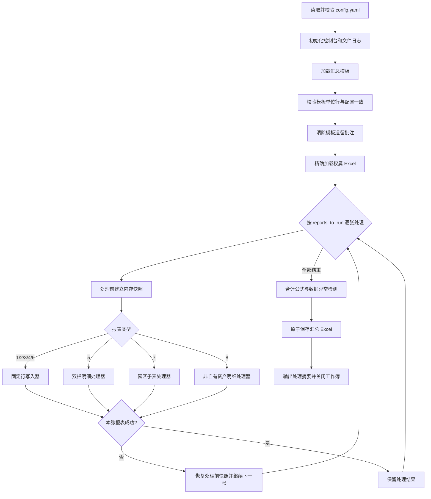

# 集团经济分析表格汇总流程及使用说明

> 权属数据：`权属数据/表格/`
> 项目目录：`project/` 
> 主入口：`main.py` 
> 配置文件：`config.yaml`

## 1. 流程定位

本项目以“汇总模板 + 各权属单位报表”为输入，按配置中的单位、行号和列范围完成 8 张报表的数据汇总，并输出：

- 一份汇总 Excel；
- 一份本次运行的 UTF-8 日志；
- 配置外单位、历史数据差异、合计公式和数据完整性等人工核对提示。

当前设计原则是：

1. 配置决定允许写入的单位和位置，不自动增加单位或修改模板映射；
2. 发现异常时优先提示，除报表本身处理失败外，不阻断其他报表；
3. 保留模板公式、格式和合并单元格结构；
4. 来源批注的作者和正文原样保留，模板遗留批注先清除；
5. 输出先写临时文件再替换正式文件，降低保存中断导致文件损坏的风险。

## 2. 输入与输出

### 2.1 输入

| 输入 | 默认位置 | 说明 |
|---|---|---|
| 汇总模板 | `../经济分析汇总表（空）.xlsx` | 包含报表1至报表8的版式、公式、合并单元格和预置单位行 |
| 权属数据 | `../权属数据/表格/` | 文件名必须与 `ownership_files.*.file` 精确一致；`~$` 临时文件会被忽略 |
| 汇总季度 | 命令行参数 | 必填，使用 `YYYYQn` 格式，例如 `2026Q2` |
| 指定模板 | `--template` / `--temp` | 可选；传入后覆盖配置中的默认模板路径 |
| 运行配置 | `config.yaml` | 权属文件、单位映射、报表结构、输出路径和运行开关；可跨季度复用 |

所有相对路径均以 `config.yaml` 所在目录为基准解析，而不是以命令行当前目录为基准。

### 2.2 输出

默认输出到 `project/output/`：

- `文旅集团{季度}资产运营情况表（汇总）.xlsx`；
- `summary_YYYYMMDD_HHMMSS.log`。

同名 Excel 正常情况下会被原子替换。如果文件正在被 Excel 占用，脚本不会覆盖已打开文件，而会生成带时间戳的副本。

## 3. 目录与模块职责

| 文件 | 主要职责 | 是否属于主流程 |
|---|---|---|
| `main.py` | 编排六个阶段、选择报表、报表级回滚、关闭工作簿 | 是 |
| `generate_next_template.py` | 从经审核的最终汇总表生成下季度模板 | 是 |
| `config.yaml` | 保存权属、报表结构和运行参数，不保存季度 | 是 |
| `engine/config_loader.py` | 加载并校验 YAML，建立“单位名称 → 权属”反向索引 | 是 |
| `engine/period.py` | 校验 `YYYYQn` 参数并生成中文季度、起止日期等期间元数据 | 是 |
| `engine/next_template.py` | 执行换期、滚转、清空、数据区遗留填充清理、批注清理和结构校验 | 是 |
| `engine/reader.py` | 加载模板和权属文件，校验模板单位行 | 是 |
| `engine/header_validator.py` | 写入前只读比较权属表与模板的主表头列范围及合并结构 | 是 |
| `engine/matcher.py` | 对名称去除空白后进行精确匹配，定位来源行 | 是 |
| `engine/writer.py` | 处理固定行报表1、2、3、4、6及相关保护性检测 | 是 |
| `engine/report5_handler.py` | 处理报表5双栏追加和动态行数 | 是 |
| `engine/report7_handler.py` | 处理报表7四个园区子表和唯一数据来源判断 | 是 |
| `engine/report8_handler.py` | 处理报表8明细追加、样式和合并区域重建 | 是 |
| `engine/comments.py` | 清理模板批注、复制来源批注、统计及回滚批注记录 | 是 |
| `engine/validator.py` | 校验合计公式范围，检测面积异常和关键字段空缺 | 是 |
| `engine/output.py` | 校验输出文件名并安全保存 | 是 |
| `logger.py` | 控制台简要日志、文件详细日志和运行摘要 | 是 |
| `tests/` | 固定报表写入、批注和日志回归测试 | 验证用途 |

## 4. 总体工作流程



### 4.1 阶段一：读取配置并初始化日志

`ConfigLoader.load()` 执行以下工作：

- 检查 `ownership_files`、`reports`、`runtime` 三个顶层配置；
- 若旧配置仍包含 `quarter`，提示改用 `--quarter YYYYQn` 并终止；
- 要求报表1至报表8均存在 `sheet_name`；
- 检查 `reports_to_run` 只能包含 1 至 8；
- 根据 `ownership_files.*.units` 建立 `unit_to_owner` 反向索引；
- 记录配置目录，供后续解析相对路径。

日志采用双通道：控制台按 `runtime.log_level` 仅输出流程阶段、分类统计、最终结果和错误；普通处理信息及逐项警告保留在日志文件中，日志文件固定记录 DEBUG 级细节。

### 4.2 阶段二：加载并校验模板

模板以 `data_only=False` 加载，以保留公式。校验范围为：

- 报表1、2、3、4、6：检查 `row_mapping` 对应的 B 列单位名称；
- 报表7：检查每个子表 `row_mapping` 对应的 A 列园区名称；
- 报表5、8：没有固定单位行，因此不做 `row_mapping` 校验。

名称匹配会移除空格、换行和制表符，但仍为精确匹配，不做简称推断或模糊匹配。模板校验及权属表格式检查完成后，脚本清除模板中的全部旧批注，避免历史批注混入本期结果。

### 4.3 阶段三：加载权属文件

脚本只加载 `ownership_files` 中明确配置且文件名精确一致的 `.xlsx`：

- 未配置的额外 Excel：记录警告并跳过；
- 配置文件缺失：记录警告，该权属不进入本次数据源；
- 单个文件加载失败：记录错误并继续加载其他权属；
- 全部权属均无法加载：流程终止。

权属文件全部加载后、任何报表写入前，脚本会执行一次只读格式检查：

- 检查权属文件是否包含对应工作表；
- 根据 `header_start_row` 到数据区上一行比较主表头有效列范围；
- 比较该表头区域内的合并单元格结构；
- 表7第一版仅检查首个子表的主表头；
- 发现异常时不修改模板、权属文件或配置，仅跳过对应“权属＋报表”并记录警告，其他内容继续处理。

该检查不解析或匹配标题文字，也不自动调整列关系。复杂差异仍需人工复核。

来源工作簿使用 `data_only=True`，因此读取的是 Excel 已保存的公式结果，而不是公式字符串。

### 4.4 阶段四：逐张报表写入与报表级回滚

每张报表处理前，`main.py` 将当前汇总工作簿保存到内存快照，并记录批注统计检查点。

- 处理成功：保留本张报表结果；
- 处理失败：关闭当前工作簿，从快照恢复，并撤销本张报表新增的批注统计；
- 失败不会阻断后续报表；
- 模板加载、配置加载、全部来源缺失或最终保存失败等全局错误仍会终止流程。

这一机制隔离的是“单张报表的修改”，不是数据库式事务；它以完整工作簿内存保存和重新加载实现，稳定但会增加运行时间和内存占用。

## 5. 各类报表的实现逻辑

### 5.1 固定行报表：1、2、3、4、6

固定报表统一由 `write_report_fixed()` 处理。

#### 写入前检测配置外单位

脚本按来源表 A 列权属范围、B 列单位名称扫描数据区：

1. 仅检查当前权属的行，避免把其他权属的预置行误报为新增单位；
2. 遇到“合计”“汇总”“总计”或以这些词结尾的标签即停止；
3. 不在本报表 `row_mapping` 中的单位只记录警告；
4. 配置外单位不会自动加入映射，也不会写入汇总表。

#### 单位与来源行定位

1. 优先用 `unit_to_owner` 根据单位名反查权属；
2. 若未找到，可使用可选的 `owner_mapping`；
3. 仍未找到时，再读取模板 A 列权属名称；
4. 在对应权属工作表 B 列中，从 `data_start_row` 起进行去空白后的精确匹配。

来源工作表、权属文件或单位行缺失时，本行记录警告并跳过。

#### 单元格写入规则

从 `data_start_col` 到 `data_end_col` 逐列处理：

- `formula_columns`：不写入，保留模板公式；
- 目标本身是公式单元格：不覆盖；
- `difference_check_columns`：覆盖前比较模板值和来源值，不同则记录完整差异；
- `text_columns`：按来源原值写入，空值仍为空；
- 其他列：仅数值原样写入，空值、`/` 和其他文本统一写为 `0`；
- 来源单元格有批注时，将作者和正文原样复制到目标单元格；
- 合并区域中的非左上角单元格不写入。

写入结束后再次比较全部合并区域坐标；结构发生变化时，本张报表失败并触发回滚。

### 5.2 报表5：资产改造情况表

报表5为左右双栏明细：左侧“拟改造”，右侧“正在改造”。处理逻辑为：

1. 遍历所有已加载权属的同名工作表；
2. 左右两侧分别提取有效记录，序号列不参与有效性判断；
3. 遇到序号列“合计”时停止提取；
4. 以左右两侧较大的记录数决定数据区长度；
5. 明细超出容量时插行并复制末行样式，少于容量时删除多余预置行；
6. 移动并重建合计行合并区域，按新数据区更新原有 SUM 公式；
7. 清空旧数据后分栏写入，重新连续编号并复制来源批注。

### 5.3 报表7：资产运营情况表（园区）

报表7按配置中的四个子表逐个处理园区：

1. 在所有已加载权属的同名工作表 A 列查找园区名称；
2. 只有 D:T 至少一个单元格有内容，才视为有效数据来源；
3. 有且仅有一个有效来源时才写入；
4. 无有效来源或出现多个有效来源时，本张报表失败并回滚；
5. A 列园区名称保留模板值，B:V 从来源行复制；
6. N、O、R、T 为模板公式列，不写入来源值；
7. B、C、U、V 为文本列，保留来源原值；其他直接填报列仅保留数值，空值、`/` 和其他文本统一写为 `0`；
8. F、J 等数值列即使来源使用公式，也写入来源文件已保存的计算值；
9. 侨乡文体和酒管集团子表的汇总行不在 `row_mapping` 中，保留模板公式，另外两个单条目子表不设汇总行；
10. 合并单元格非左上角跳过，批注随实际写入单元格复制。

### 5.4 报表8：非自有资产情况

报表8为单栏明细追加：

1. 汇集所有权属同名工作表中的有效记录；
2. 以 B:L 任一字段有内容判断记录有效，A 列序号不作为有效性依据；
3. 解除旧数据区合并，仅保留表头合并；
4. 按记录总数插入或删除数据行；
5. 完整复制来源值、样式、行高和批注，并重新生成 A 列序号；
6. 将来源数据区中可映射且连续的合并区域重建到目标行；
7. 最后校验实际合并区域与预期一致。

## 6. 批注、校验和告警

### 6.1 批注处理

- 模板旧批注：写入前全部清除；
- 来源批注：只对实际参与写入的单元格复制；
- 作者和正文：来源是什么就保留什么，不改写作者名称；
- 统计：记录清除数、复制数和来源/目标位置；
- 回滚：单张报表失败时撤销该报表的批注统计记录。

### 6.2 合计公式校验

仅校验固定报表1、2、3、4、6。由于 openpyxl 不负责重算公式，脚本不使用公式缓存值，而是：

1. 自行合计完整数据区的数值；
2. 解析合计行中形如 `=SUM(C4:C13)` 的单列公式；
3. 自行合计公式引用区；
4. 比较两者，差额超过 `0.01` 时提示公式可能漏行或错列。

非 SUM 公式、无法解析的 SUM 形式或无数值列会标记为“未校验”，不会自动改公式。

### 6.3 数据完整性和异常值检测

检测项包括：

- 配置的面积列出现负数；
- 面积超过默认阈值 `1,000,000 ㎡`；
- 有单位/序号标识，但关键输入字段全部为空。

检测只输出报告和日志，不修改工作簿。面积列优先使用各报表的 `area_columns`，仅在未配置时才尝试从表头识别。

### 6.4 常见告警的含义

| 告警 | 含义 | 是否自动处理 |
|---|---|---|
| 未找到权属文件 | 配置要求的文件不存在或文件名不一致 | 不写入该权属，继续运行 |
| 未配置单位检测 | 来源表出现配置外单位 | 只提示，不写入 |
| 环比/同比数据差异检测 | 指定列的模板历史值与来源值不同 | 提示后仍写入来源值 |
| 单位未找到/工作表缺失 | 当前固定行无法定位来源 | 跳过该行 |
| 合计值校验警告 | SUM 公式引用范围可能不完整 | 只提示，需人工检查模板 |
| 关键字段均为空 | 该行有标识但没有实际输入数据 | 只提示 |
| 目标文件正在使用 | Excel 锁定了同名结果 | 自动另存时间戳副本 |

## 7. 配置文件说明

### 7.1 汇总季度参数

季度不再写入 `config.yaml`，每次运行必须通过 `--quarter YYYYQn` 提供，例如
`--quarter 2026Q2`。程序会在内存中生成：

- `code`：标准季度代码，如 `2026Q2`；
- `label`：中文季度，如 `2026年第二季度`，用于日志和输出文件名；
- `start_date` / `end_date`：本年起始日和季度截止日，作为期间元数据；
- `year` / `quarter`：年份和季度序号。

`YYYYQn` 不区分字母大小写，但季度只能是 `Q1` 至 `Q4`。

### 7.2 `ownership_files`

```yaml
ownership_files:
  商业集团:
    file: "商业集团.xlsx"
    units: ["商业集团"]
```

- 键名是权属标识；
- `file` 是数据目录中的精确文件名，`null` 表示无独立数据文件；
- `units` 是该文件所包含的可匹配单位名称，并用于建立反向索引；
- 同一个单位不能同时配置到多个权属。

### 7.3 固定报表常用字段

| 字段 | 作用 |
|---|---|
| `sheet_name` | 模板和来源中的工作表名称 |
| `header_start_row` | 权属表格式检查使用的主表头起始行；结束行为数据区上一行 |
| `data_start_row` / `data_end_row` | 固定数据区 |
| `total_row` | 合计行 |
| `a_col` / `b_col` | 权属列和单位列 |
| `data_start_col` / `data_end_col` | 写入列范围 |
| `row_mapping` | 汇总目标行 → 来源单位名称 |
| `formula_columns` | 保留模板公式、不直接写入的列 |
| `text_columns` | 允许文本原样写入的列 |
| `difference_check_columns` | 覆盖前执行历史值差异提示的列 |
| `area_columns` | 数据异常检测所使用的面积列 |
| `formula_number_format` | 公式列和合计行的数字格式 |

### 7.4 `runtime`

```yaml
runtime:
  template_path: "../经济分析汇总表（空）.xlsx"
  data_dir: "../权属数据/表格/"
  output_dir: "output/"
  output_filename: "文旅集团{quarter_label}资产运营情况表（汇总）.xlsx"
  reports_to_run: [1, 2, 3, 4, 5, 6, 7, 8]
  enable_validation: true
  log_level: "INFO"
```

- `reports_to_run` 可选择执行部分报表；模板校验和结果校验也会随之缩小范围；
- `enable_validation: false` 可跳过写入后的合计与异常检测；
- `output_filename` 只能使用 `{quarter_label}` 占位符，且必须以 `.xlsx` 结尾；
- `{quarter_label}` 来自本次 `--quarter` 参数，不需要修改配置文件。

### 7.5 `next_template`

`next_template` 仅用于生成下季度填报模板，不参与常规汇总写入。主要字段如下：

| 字段 | 作用 |
|---|---|
| `output_filename` | 下季度模板文件名；支持 `{quarter_label}` 占位符 |
| `clear_manual_fills` | 是否清除数据区内遗留的直接填充；不处理数据区外样式 |
| `reports` | 各报表的清空、滚转和行数规则 |
| `clear_columns` | 固定报表中下季度需要清空的数据列 |
| `preserve_formula_columns` | 清空时保留公式的列；其中非公式值仍会被清空 |
| `roll_columns` | 当前季度数据列到下季度对比列的滚转关系 |
| `target_max_row` | 明细报表清空后的最大行数，目前表5、表8为20行（数据行） |

`next_template.reports` 中的报表规则必须与源最终汇总表的实际版式和单位行保持一致。新增单位、删除单位或调整单位顺序时，应同时更新对应报表的配置信息。

## 8. 使用方法

### 8.1 环境准备

Python 3.10 及以上环境，并安装依赖：

```powershell
python -m pip install openpyxl pyyaml
```

### 8.2 每期运行前检查

1. 关闭拟覆盖的汇总 Excel，避免生成时间戳副本；
2. 将权属文件放入 `权属数据/表格/`；
3. 确认文件名与 `ownership_files.*.file` 完全一致；
4. 确认本次运行将传入正确的 `--quarter YYYYQn`；
5. 模板版式或单位顺序变化时，同步核对各报表的 `row_mapping`、列范围、公式列、文本列和面积列；
6. 常规汇总流程中，新增单位只会触发警告；确认需要纳入后，应人工修改模板和配置，再重新运行。下季度模板生成的配置一致性处理规则见 8.4。

### 8.3 执行完整流程

在 `PowerShell` 中：

```powershell
cd "D:\workspace\集团经济分析_表格部分\project"
python main.py --quarter 2026Q2
```

指定其他模板时，运行时参数优先于配置文件：

```powershell
python main.py --quarter 2026Q2 --template "D:\path\to\模板.xlsx"
```

如需使用其他静态配置文件：

```powershell
python main.py --quarter 2026Q2 --config "D:\path\to\config.yaml"
```

程序结束后，终端会打印实际汇总文件和日志路径。详细单元格来源、批注和警告应以本次 `summary_*.log` 为准。

### 8.4 生成下季度模板

下季度模板应由“当前季度、已审核确认的最终汇总表”生成。`--quarter` 表示源文件所属季度，程序自动推导目标季度；`--source` 必须明确指定源文件，程序不会根据文件名猜测源表。输出默认保存到 `runtime.output_dir`，不会覆盖源文件：

```powershell
python generate_next_template.py `
  --quarter 2026Q2 `
  --source "D:\path\to\2026年第二季度最终汇总表.xlsx"
```

如使用其他配置文件，增加 `--config`：

```powershell
python generate_next_template.py `
  --quarter 2026Q2 `
  --source "D:\path\to\2026年第二季度最终汇总表.xlsx" `
  --config "D:\path\to\config.yaml"
```

程序会自动生成 `2026年第三季度` 模板，并按以下顺序处理：

- **先做配置一致性检查。** 在清空数据、滚转数值、清除样式和保存输出前，先将源汇总表实际结构与 `config.yaml` 对照。固定行报表检查新增单位、配置单位缺失、重复单位、单位行位移、数据区结束行变化和合计行变化；报表5检查左右合计行；报表7按各子表分别检查。
- **发现不一致时只检测和提示，不自动修正。** 程序会在终端和 `next_template_*.log` 中一次性打印全部差异，并停止本次生成，不会自动增加单位映射、插入或删除模板行、修改合计行配置，也不会保存半成品模板。
- 更新标题区及固定报表数据区外说明文字中的季度、截止日期、环比和同比期间；
- 报表1执行 `D → E`，报表3执行 `C → D`、`F → G`、`I → J`；
- 按 `next_template.reports` 清空下季度需要重新填报的数据；
- 滚转时只写入 Excel 已保存的计算结果，不复制公式或批注；
- 保留配置指定的公式和数据区外结构，清除数据区内直接涂色形成的遗留填充；
- 不主动解除源表合并单元格；报表5缩行时，原合计行合并随合计行移动；
- 报表5、报表8清空后固定为20行，其中报表5第20行为合计行；
- 清除全部批注，并生成 `next_template_*.log` 处理日志。

#### 配置与汇总表不一致时的处理方法

以源汇总表新增“泉旅酒管”为例，若日志提示“新增单位”，先不要直接反复运行或手工修改输出文件。按以下步骤处理：

1. 在源最终汇总表中确认该单位是否确实属于本期正式数据，以及所在报表、行号和合计行位置是否正确。
2. 如果是合法的组织或版式变化，人工修改 `config.yaml`：补充相应 `ownership_files.*.units`，并在涉及的报表中更新 `row_mapping`；如数据区长度或合计行发生变化，再同步修改 `data_end_row`、`total_row` 或报表7的 `sub_tables`。
3. 如果是源汇总表误填、重复行或临时行，则先修正源最终汇总表，保留配置不变。
4. 重新执行同一条命令，直到日志显示“源汇总表与配置一致性检查通过”。程序只会在检查通过后继续生成模板。
5. 生成成功后，人工抽查新增或调整报表的单位顺序、合计行、公式和数据区边界，再将输出模板作为下季度填报模板使用。

注意：一致性检查只负责发现和报告差异，不判断业务上的“应当如何修改”。配置和源表的修正必须由业务人员确认后完成；不要为了绕过检查而删除源表单位、改动无关报表或关闭检查逻辑。源表标题与 `--quarter` 不一致、滚转源公式缺少已保存结果或工作表缺失时，同样会停止保存并要求人工核对。

### 8.5 选择部分报表

修改`config.yaml`：

```yaml
reports_to_run: [1, 4]
```
